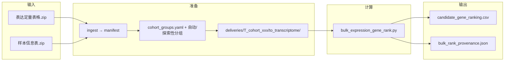
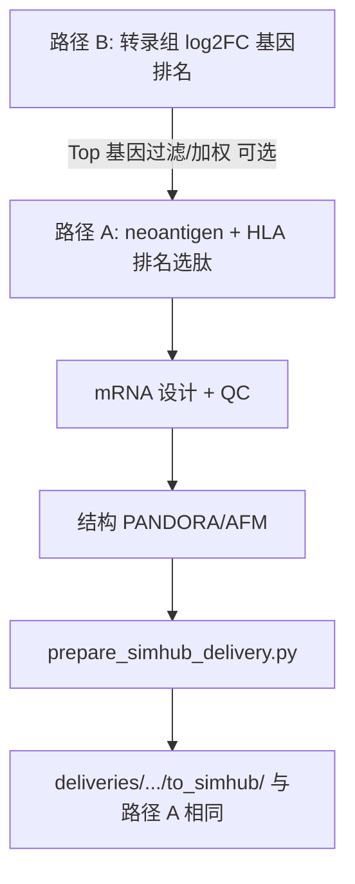

# ImmunoGen（mRNA 疫苗 / 免疫基因）

**负责人：** 梁心恬  
**模块定位：** 基于病人特异性新抗原（Neoantigen）设计多价 mRNA 疫苗。  
**一句话目标：** 从 BioDriver 的候选新抗原 + HLA 分型，输出候选 mRNA 全序列（含 UTR、密码子优化、多价串联设计），并按要求准备 Simulation Hub 交付包。

**当前阶段侧重（对上接口）：** 上游**暂时仅有** bulk 转录组（表达矩阵 + 可定义分组的样本信息）时，**优先落地路径 B**（`bulk_expression_gene_rank.py` 或 `run_all.py --target transcriptome_prior`），交付 `candidate_gene_ranking.csv` 与 `bulk_rank_provenance.json` 作为**基因池优先级与溯源**。**路径 A**（新抗原 → MHC 排序 → 多价 mRNA → SimHub）仍是本模块的完整设计目标；待 **突变肽 + VAF + HLA** 与 `to_immunogen/` 契约输入齐备后，与路径 B 输出**衔接**（路径 B 不替代 `neoantigen_candidates.csv` / `hla_typing.json`）。

---

## 0. 一分钟导读

本模块用于病人个性化 mRNA 肿瘤疫苗设计：读取 BioDriver 的候选突变肽与 HLA 分型，综合 MHC 结合、免疫原性、VAF、与 WT 差异进行排序，选择 Top 10-20 肽段串联成多价 ORF，拼接 UTR/polyA 并生成完整 mRNA 序列，同时准备 SimHub 需要的 peptide-MHC 交付包。

**与上衔接：** 若当前仅有转录组，请先看 **§1.1A 路径 B** 与 **`--target transcriptome_prior`**；全链路 smoke 仍以路径 A 为准（见下节）。

第一阶段 smoke 目标：跑通 1 个病人 -> Top-10 neoantigen -> 1 条多价 mRNA -> 至少 1 个 peptide-MHC 交付包。  
交付节奏：先完成 `POSITIVE_CONTROL.md` / `SELF_CHECK.md` / `REPORT.md`，再提交 SimHub。

---

## 1. 输入输出契约

### 1.1 上游输入（BioDriver）

**说明：** 若当前上游**仅有**转录组数据，**尚不具备**下列文件时，请先走 **§1.1A 路径 B**；待突变与 HLA 齐备后再按本小节准备 `to_immunogen/`。

`deliveries/<run_id>/to_immunogen/`：

- `neoantigen_candidates.csv`（`mutation, mut_peptide, wt_peptide, transcript_id, variant_vaf`）
- `hla_typing.json`（I 类必备：`HLA-A/B/C`；II 类可选见 `docs/hla_typing.md`）
- `meta.json`

#### 1.1A 科学范围说明（双路径；**当前优先路径 B**）

| 路径 | 输入 | 产出 | 是否交付 SimHub |
|------|------|------|-----------------|
| **B** | bulk TPM + 样本分组（或 `data/表达定量表格.zip` + `data/样本信息表.zip`） | 基因优先级 CSV | **否**（无肽/HLA/PDB） |
| **A** | `to_immunogen/` 新抗原 + HLA | mRNA + peptide-MHC 排名 + 结构 | **是**（`to_simhub/` 五件套） |

**交给 SimHub 的包只有一种形态**：路径 A 末端的 `prepare_simhub_delivery.py` 生成的 `peptide_mhc` 目录（`complex.pdb`、`meta.json` 等）。路径 B **单独跑完不会产生** `to_simhub/`；要与路径 A 一致，须在 B 之后接上 A 全流程（见下文「B → A → SimHub」）。

##### 路径 B 流程（转录组基因优先级）

面向 `data/表达定量表格.zip`（`TPM_<队列ID>_cleaning.txt`）与 `data/样本信息表.zip`（`pdata_<队列ID>.csv`）。**约定一队列一个 run_id**：`T_cohort_<队列ID>`（如 `T_cohort_39004`）。



分组策略（`data/transcriptome/cohort_groups.yaml` 可覆盖）：

1. **肿瘤 vs 正常**：`title` / `source_name_ch1` 启发式（如队列 39004）。
2. **探索性**：`death:ch1` 或 `meta:ch1` 二分（如 1 vs 0）；`bulk_rank_provenance.json` 中 `exploratory: true` 并附中文 caution，**不得单独作为疫苗设计依据**。
3. **跳过**：manifest 未配对或配置 `strategy: skip` 的队列不跑 log2FC。

**推荐命令（单队列）：**

```bash
# 首次：解压 zip 并生成 data/transcriptome/manifest/cohorts.csv
python scripts/ingest_transcriptome_archives.py

# 单队列（写 to_transcriptome + 排名）
python scripts/run_transcriptome_cohort.py --cohort_id 39004

# 等价一键入口
python scripts/run_all.py \
  --run_id T_cohort_39004 \
  --target transcriptome_prior \
  --cohort_id 39004
```

**批量：**

```bash
python scripts/run_transcriptome_batch.py
python scripts/run_transcriptome_batch.py --dry_run   # 只解析分组，不跑排名
```

**路径 B 输入 / 输出目录：**

| 位置 | 内容 |
|------|------|
| `deliveries/T_cohort_<id>/to_transcriptome/` | `tpm_matrix.tsv`、`sample_groups.json`、`meta.json` |
| `results/T_cohort_<id>/transcriptome_prior/` | `candidate_gene_ranking.csv`、`bulk_rank_provenance.json` |

**仍支持手工指定矩阵与 GSM 列名**（非 zip 场景）：

```bash
python scripts/bulk_expression_gene_rank.py \
  --tpm_path /path/to/TPM_matrix.tsv \
  --out_dir results/<run_id>/transcriptome_prior \
  --case_columns "GSMxxx,GSMyyy" \
  --control_columns "GSMaaa,GSMbbb"

python scripts/run_all.py --run_id <run_id> --target transcriptome_prior \
  --bulk_tpm_path /path/to/TPM_matrix.tsv \
  --bulk_case_columns "GSMxxx,GSMyyy" \
  --bulk_control_columns "GSMaaa,GSMbbb"
```

可选：`--bulk_gene_col_name`、`--bulk_pseudo`、`--bulk_out_subdir`（见 `run_all.py --help`）。  
**刻意限制**：未使用 `--cohort_id` 时，须同时提供 `--bulk_case_columns` 与 `--bulk_control_columns`，避免无对照排序被误用为疫苗依据。

##### 路径 A 流程与 SimHub 交付

在具备 **突变肽 + VAF + HLA**（`deliveries/<run_id>/to_immunogen/`）时运行：


每个 SimHub 子目录（如 `public_case_001_md_r01`）包含：

- `complex.pdb`（Chain M/B/P，全原子肽–MHC）
- `hla_allele.txt`
- `meta.json`（`molecule_type: "peptide_mhc"`）
- `selected_for_md.csv`（单行肽段表）
- `dossier_context.json`（肽 + mRNA 材料指针）

```bash
python scripts/run_all.py --run_id R_public_001
python scripts/check_simhub_evidence.py --run_id R_public_001
```

##### B → A → SimHub（与路径 A 相同的 SimHub 包）

路径 B 只提供**基因池**；要与路径 A **同一套** SimHub 交付，须在**同一 `run_id`** 上同时具备 `to_immunogen/` 与 `results/<run_id>/transcriptome_prior/candidate_gene_ranking.csv`，再执行 B→A 衔接（按 Top 基因过滤突变肽后走路径 A，SimHub 包与纯路径 A 相同）。

```bash
# 1) 路径 B（示例：队列 39004）
python scripts/run_all.py --run_id T_cohort_39004 --target transcriptome_prior --cohort_id 39004

# 2) 将同一病人的 neoantigen + HLA 放入同一 run_id 的 to_immunogen/（或先用独立 R001 再合并 run_id）

# 3) B→A→SimHub 一键（过滤 + 路径 A 全流程）
python scripts/run_b_to_a_simhub.py --run_id <run_id> --top_n_genes 500

# 或等价：
python scripts/run_all.py --run_id <run_id> --target b_to_a_simhub --b_to_a_top_n_genes 500

# 仅过滤突变肽池：
python scripts/filter_neoantigen_by_gene_rank.py --run_id <run_id> --top_n_genes 500
```

`neoantigen_candidates.csv` 建议含 `gene_name` / `gene_symbol`；若无，脚本会尝试从 `mutation`（如 `KRAS_G12D_1`）解析基因符号。



单细胞（10X / h5ad 等）用于**细胞类型与微环境解读**时，建议在路径 B 或独立分析中完成；**若要将 sc 结果与路径 A 衔接**，仍需同一个体的 **DNA 突变层 + HLA** 进入主线。

### 1.2 本模块输出（结果产物）

`results/<run_id>/`：

**路径 B 当前侧重时**，以下主线产物可能尚未生成；以 `transcriptome_prior/` 下侧车输出为准。

- `peptide_mhc_ranking.csv`
- `selected_peptides.csv`
- `mrna_vaccine.fasta`
- `mrna_design.json`
- `qc_metrics.json`
- `figures/binding_affinity_heatmap.png`
- `figures/mrna_secondary_structure.png`
- `REPORT.md`
- `POSITIVE_CONTROL.md`
- `SELF_CHECK.md`
- `FEASIBILITY.md`
- `simhub_evidence/<case_id>/`（接收 SimHub 回传证据；含 `evidence_status.json` 与 `SIMHUB_EVIDENCE.md`）
- `meta.json`（本 run 摘要，与 SimHub 交付 `meta.json` 分工独立）
- （路径 B，仅执行侧车时）`transcriptome_prior/candidate_gene_ranking.csv` 与 `transcriptome_prior/bulk_rank_provenance.json`（见 §1.1A；**非**新抗原主线必交付物）

### 1.3 下游交付（Simulation Hub）

**仅路径 A 产生**（见 §1.1A「路径 A 流程与 SimHub 交付」）。路径 B 的 `T_cohort_*` run **不含** `to_simhub/`。

`deliveries/<run_id>/to_simhub/<case_id>/`（**支持多 MD case**：若 `meta.json` 中 `case_id` 为 `demo_case_001`，则可能同时存在 `demo_case_001_md_r01` … 子目录；每条对应一个 peptide-MHC `complex.pdb`）： 

- `complex.pdb`（Chain M/B/P）
- `hla_allele.txt`（可选）
- `meta.json`（`molecule_type: "peptide_mhc"`）
- `selected_for_md.csv`
- `dossier_context.json`（peptide + mRNA 最终 dossier manifest）

注意：peptide-MHC 分支禁止使用 SDF。

SimHub 回传证据检查：

```bash
python scripts/check_simhub_evidence.py --run_id R001
```

状态枚举：`not_returned`、`returned_unvalidated`、`validation_passed`、`validation_failed`。

---

## 2. 当前流程能力（已实现）

**路径 B（转录组 zip / 队列）**

0. `ingest_transcriptome_archives.py`：解压 `data/表达定量表格.zip`、`data/样本信息表.zip`，生成 `data/transcriptome/manifest/cohorts.csv`  
0b. `run_transcriptome_cohort.py` / `run_transcriptome_batch.py`：按队列解析分组（含探索性 death/meta）并写 `to_transcriptome` + 基因排名  
0c. `validate_transcriptome_input.py`：校验 `deliveries/<run_id>/to_transcriptome/`  
0d. `bulk_expression_gene_rank.py`：bulk 矩阵 + 病例/对照 GSM 列 → `candidate_gene_ranking.csv`；或由 `run_all.py --target transcriptome_prior`（`--cohort_id` 或 `--bulk_*`）调用  

**路径 A（疫苗主线 + SimHub）**

1. `validate_input.py`：输入契约检查  
2. `run_immunogenicity_adapters.py`：免疫原性适配器（auto/real_tsv/real_cmd/proxy）  
3. `predict_mhc_ranking.py`：MHC-I 主预测 + MHC-II 层 + 综合排序  
4. `select_top_peptides.py`：Top-N + WT 相似性过滤  
5. `build_multivalent_mrna.py`：多价串联 + UTR/polyA + 密码子模式  
6. `run_qc_and_report.py`：结构图、QC、报告  
7. `prepare_self_certification.py`：自证最小包  
8. `prepare_simhub_delivery.py`：SimHub 交付封装  
9. `validate_feasibility.py`：可行性验证

**多维 MD（任务书 Top 3–5）简述**：先用 `scripts/run_pandora_structure.py --run_id R001 --top_k 5`（或 `--top_k` 与 `--top_k_md` 一致），再运行 `prepare_simhub_delivery.py --run_id R001 --top_k 5 --structure_backend pandora`，**不显式传入** `--structure_input_pdb` 即可生成多个 SimHub 子目录。也可用 `python scripts/run_all.py --run_id R001 --prepare_pandora --top_k_md 5`（需环境已安装并可运行 PANDORA）。

四 run 批量：`python scripts/run_path_a_simhub_top5_batch.py`（默认 `R001`/`R002`/`R003`/`R_public_001`）。PANDORA 与 **Biopython 1.79** 兼容（`pip install csb-pandora biopython==1.79`）；`tools/pandora_bin/muscle` 须在 `PATH` 或设置 `PANDORA_REAL_MUSCLE`。

一键运行：

```bash
python scripts/run_all.py --run_id R001
```

**Positive Control（KRAS G12D）**：若某 run 的排名未把 `VVGADGVGK` 自然选入 Top‑N，可在不改 `top_n` 的前提下使用：

```bash
python scripts/run_all.py --run_id R_public_001 --ensure_positive_control_peptides VVGADGVGK
```

（等价于传给 `select_top_peptides.py`：在过滤池中则用该肽替换入选集中 **`rank_score` 最低的一条**。）

真实来源常态化（推荐）：

```bash
# MHC-I：先准备 NetMHCpan real_tsv（可由真实工具输出，或由 openvax 报告桥接）
python scripts/openvax_bridge.py --run_id R001 --input "/path/to/vaccine-peptide-report.txt"

# MHC-II：支持 real_tsv（无需每次都调用 netMHCIIpan 二进制）
# 文件路径：results/R001/tool_outputs/raw/mhc2_netmhciipan.tsv
# 必需列：mut_peptide + (mhc2_el_rank|el_rank|pct_rank_el|rank)

# 运行并强制真实后端
python scripts/run_all.py --run_id R001 --target mhc_ranking --backend_mhc1_netmhcpan real_tsv --backend_mhc1_bigmhc off --mhc2_backend real_tsv --require_real_mhc1_cv --require_real_mhc2

# 验收
python scripts/check_epitope_realization.py --run_id R001 --require_mhc1_cv_real --require_mhc2_real
```

MHC-I **`real_cmd`（本机 netMHCpan 自动跑，不写死 TSV）**：

```bash
# 依赖：已安装 NetMHCpan 4.x，并可从当前环境调用（或设 NETMHCPAN_BIN / NETMHCPAN_HOME）
export MHC1_NETMHCPAN_CMD='python tools/netmhcpan_class1_runner.py --input {input_tsv} --output {output_tsv}'

python scripts/run_all.py --run_id R001 --target mhc_ranking \
  --backend_mhc1_netmhcpan real_cmd --backend_mhc1_bigmhc off \
  --mhc2_backend real_tsv --require_real_mhc1_cv --require_real_mhc2 \
  --backend_prime real_tsv --backend_repitope real_tsv \
  --require_real_immunogenicity_prime --require_real_immunogenicity_repitope
```

说明：若未提供 `results/<run_id>/tool_outputs/raw/prime.tsv` 或 `repitope.tsv`（或未配置对应 `real_cmd`），上述两个 `require_real_immunogenicity_*` 会阻止流程回退 proxy，并直接报错，确保 PRIME/Repitope 为真实来源。

说明：`predict_mhc_ranking` 会生成临时 `mhc1_netmhcpan_input.tsv` 并调用上述命令；包装器见 `tools/netmhcpan_class1_runner.py`。包装器**默认**为 NetMHCpan 4.2+ 追加 **`-BA`** 以得到 `Aff(nM)` 亲合力列；环境变量见 `NETMHCPAN_LEN`、`NETMHCPAN_EXTRA`、`NETMHCPAN_TIMEOUT`、`NETMHCPAN_BA`（设 `0` 可禁用 `-BA`，但表头常无 nM 会导致解析失败）。快速加载： `source scripts/env_netmhcpan.sh`（请按本机修改其中 `NETMHCPAN_HOME`）。

MHC-I **BigMHC `real_cmd`（KarchinLab [BigMHC](https://github.com/KarchinLab/bigmhc)，可选增强，默认不启用）**：

> 说明：BigMHC 不是流程必需项。当前推荐仅启用 NetMHCpan 作为 MHC-I 真实后端，BigMHC 可在网络与环境稳定后再补充为第二路交叉验证。

推荐（默认关闭 BigMHC，不阻塞主流程）：

```bash
python scripts/run_all.py --run_id R001 --target mhc_ranking \
  --backend_mhc1_netmhcpan real_cmd --backend_mhc1_bigmhc off \
  --mhc2_backend real_tsv --require_real_mhc1_cv --require_real_mhc2
```

可选增强（启用 BigMHC 第二路）：

```bash
# 1) 克隆官方仓库（体积大，约数 GB），按官方 README 安装 PyTorch 等依赖
# 2) 设仓库根目录（其下含 src/predict.py），或显式指定 predict.py
export BIGMHC_HOME="/path/to/bigmhc"
export MHC1_BIGMHC_CMD='python tools/bigmhc_runner.py --input {input_tsv} --output {output_tsv}'

python scripts/run_all.py --run_id R001 --target mhc_ranking \
  --backend_mhc1_netmhcpan real_tsv --backend_mhc1_bigmhc real_cmd \
  --mhc2_backend real_tsv --require_real_mhc1_cv --require_real_mhc2
```

包装器见 `tools/bigmhc_runner.py`：内部调用 `predict.py -m=el`（呈递 EL 模型），把 `BigMHC_EL` 列映射为 `mhc1_cv_bigmhc_score`。可选：`BIGMHC_MODEL`（默认 `el`）、`BIGMHC_DEVICE`（默认 `cpu`）、`BIGMHC_PREDICT_PY`（覆盖 `predict.py` 路径）。

多实例（`R002` / `R003` / `R_public_001` 等）在跑 `--backend_mhc1_netmhcpan real_tsv` 前，都需在**对应**目录放置两份表：

- `results/<run_id>/tool_outputs/raw/mhc1_netmhcpan.tsv`（I 类交叉验证；行数应覆盖本 run 的候选肽 × 病人 I 类 allele，至少肽级有值）
- `results/<run_id>/tool_outputs/raw/mhc2_netmhciipan.tsv`（II 类；`hla_typing.json` 里暂无 II 类时可用参考 `DRB1*15:01` 等**演示**用途，终版需换患者真实分型结果）

预检 + 可选自动跑数与验收：

```bash
python scripts/bootstrap_real_backends.py --run_id R002 --with_mhc2
python scripts/bootstrap_real_backends.py --run_id R002 --with_mhc2 --run --validate
```

I 类表亦可从外部分析经 `scripts/openvax_bridge.py` 等生成；最小列模板见 `data/examples/mhc1_cv_templates/mhc1_netmhcpan.tsv`。

---

## 3. 建议执行步骤（任务书对齐）

1. 基线验证：挑 1 个已知强免疫原性 neoantigen（如 KRAS G12D）跑通全流程  
2. 真实病例：对 Top 30-50 候选做 MHC + 免疫原性评分  
3. 排序筛选：按 `rank_score` 取 Top 10-20  
4. 多价设计：ORF 串联 + 密码子优化 + UTR 拼接 + 二级结构检查  
5. SimHub：选 Top 3-5 peptide-MHC 做 MD 稳定性验证

---

## 4. 验收标准

- 可复现：新环境按 README 可跑通
- 先自证再交付：必须有 `POSITIVE_CONTROL.md`、`SELF_CHECK.md`、`REPORT.md`
- 完整性：排名 + 多价设计 + mRNA 三件套齐全
- 可解释性：Top 候选含 HLA / 免疫原性 / VAF 证据
- Positive Control：至少 1 个已知 neoantigen 被识别为高分

---

## 5. 当前边界与风险

- MHC-II 预测精度低于 MHC-I，需要在报告注明
- 免疫原性 AI 预测不确定性较大，不替代湿实验
- 当前正式交付默认要求 PANDORA/AFM 等真实结构；`coarse` 仅保留为显式调试选项，不能作为真实交付。
- 第一阶段不做 LNP 处方设计，仅保留综述说明（`docs/lnp_notes.md`）

---

## 6. 相关文档

- `RELEASE_NOTES.md`
- `data/transcriptome/cohort_groups.yaml`（队列分组规则，含探索性排序与 skip）
- `docs/hla_typing.md`
- `docs/netmhciipan_setup.md`
- `docs/structure_backend_selection.md`
- `docs/TODO.md`
- `FINAL_CHECKLIST.md`
